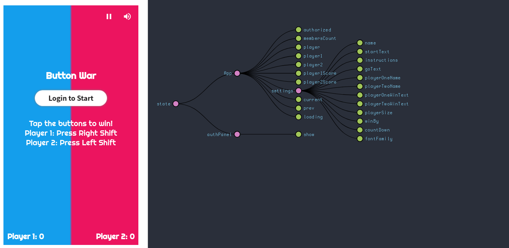

# Button War

A competitive button mashing game, which is the exploration that integrates the [Koji](https://gokoji.com) mini apps into [Rokcet.Chat](http://rocket.chat)!

## Features
| Name | Status |
| :-: | :-: |
| Rocket.Chat Authorization | Working in Progress |
| Websocket | √ |
| ... | ... |

## VCC's

- 🎮 Change the text and game settings
    * [Open configuration](#~/.koji/customization/settings.json!visual)
- 🖼️ Replace the button images
    * [Open configuration](#~/.koji/customization/images.json!visual)
- 🔈 Change the sounds and background music.
    * [Open configuration](#~/.koji/customization/sounds.json!visual)
- 💅 Change the colors and visual style
    * [Open configuration](#~/.koji/customization/colors.json!visual)
- ⚙️ Add your Google Analytics ID and Open Graph information for sharing
    * [Open configuration](#~/.koji/customization/metadata.json!visual)

## Structure
### ~/
This is the main directory
- [index.html](#~/index.html) is the main html file where the game canvas, and overlay elements are declared.
- [index.js](#~/index.js) is the main javascript file that initializes and loads the game.
- [style.css](#~/style.css) this file contains css styles for the game canvas, and overlay elements.

### ~/game/
This directory contains the main game code.
- [game/main.js](#~/game/main.js) is where the load, create, and play loop are setup.
- [game/overlay.js](#~/game/overlay.js) controls the html overlay for displaying game text.

### ~/game/characters
This directory contains code for the game characters.
- [Button: game/characters/button.js](#~/game/characters/button.js) code for the buttons.
- [Point: game/characters/point.js](#~/game/characters/point.js) code for the point score animation.
- [Background: game/characters/background.js](#~/game/characters/background.js) code for the background.

### ~/game/objects
This directory contains code base classes like image, sprite, etc.
- [Image: game/objects/image.js](#~/game/objects/image.js) a simple images class.
- [Sprite: game/objects/sprite.js](#~/game/objects/sprite.js) a sprite class building game characters with. Being a sprite, gives a character abilities like movement in the x and y direction, speed, and bounding areas.

### ~/game/helpers
This directory contains helper code for loading assets and and requesting frames.
- [assetLoaders: game/helpers/assetLoaders.js](#~/game/helpers/assetLoaders.js) a collections of functions to help load image, sound, and font assets.
- [animationFrame: game/helpers/sprite.js](#~/game/helpers/animationFrame.js) a shim for requestAnimationFrame, the browsers method for asking for a new frame. Browsers request around 60 frames per second depending on resources.
- [utils: game/helpers/utils.js](#~/game/helpers/utils.js) a collection of useful functions for making games.

## Support
### Community
If you need any help, you can ask the community by [making a post](https://gokoji.com/posts), or [joining the discord](https://discordapp.com/invite/eQuMJF6).

### Helpful Resources
- [Mozilla Game Development Docs](https://developer.mozilla.org/en-US/docs/Games).
- [HTML5 Game Devs Forum](http://www.html5gamedevs.com/).